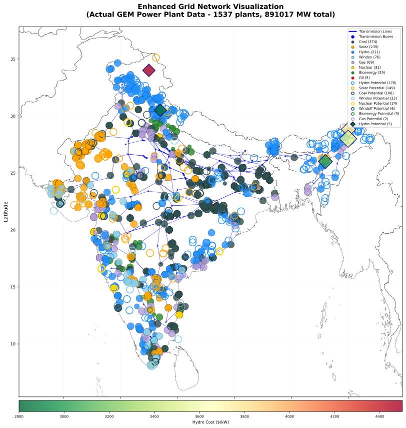
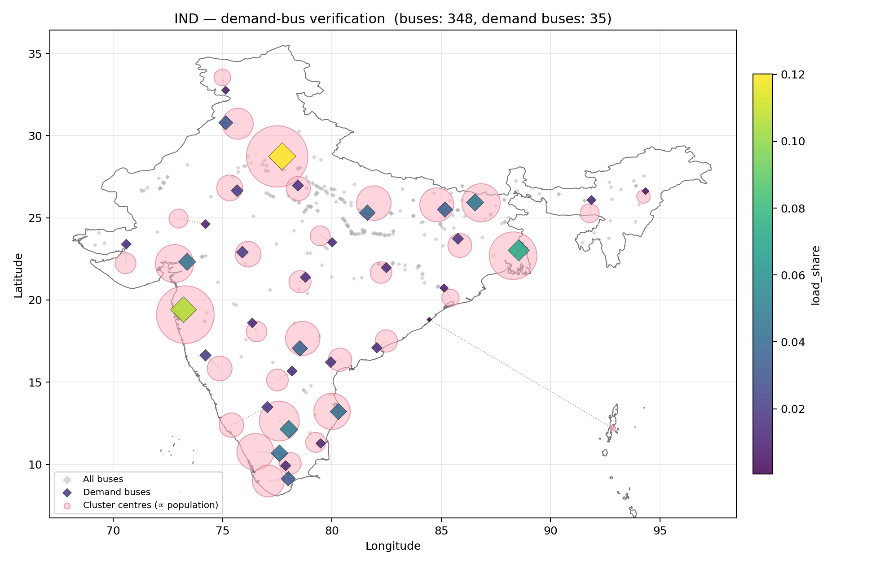

# Transmission Grid — IND

---

### Grid Network Visualization

  
  
<em>Transmission infrastructure, power plants, and renewable energy zones</em>

---

## Transmission Infrastructure

| Metric | Value | Description |
|--------|-------|-------------|
| **Total Buses** | 348 | Transmission substations and connection points |
| **Transmission Lines** | 459 | High-voltage transmission corridors |

## Power Plant Integration

| Integration Type | Count | Description |
|------------------|-------|-------------|
| **Plants Mapped to Buses** | 4514 | GEM power plants assigned to grid locations |

---

## Spatial Resolution & Renewable Zones

| Spatial Metric | Value | Detail |
|----------------|-------|--------|
| **Grid Cells** | 2747 | 50×50 km renewable energy zones |
| **Solar / Wind Onshore Zones** | 1642 | Grid cells with solar and onshore wind potential |
| **Wind Offshore Zones** | 235 | Grid cells with offshore wind potential |
| **Zone–Bus Mappings** | 1878 | REZoning zones assigned to transmission buses |

**Commodity naming:** `elc_spv_<ISO3>_<cluster_id>` · `elc_won_<ISO3>_<cluster_id>` · `elc_wof_<ISO3>_<cluster_id>`

*→ [Grid processing pipeline details](https://vervestacks.readthedocs.io/en/latest/methods/grid-representation.html#transmission-line-modeling)*

---

## Demand-to-Bus Mapping

Electricity demand shares are distributed across the transmission network using
**demand-region clustering** with nearest-bus assignment:

| Load Distribution Method | Buses with Load | Total Load Share | Methodology |
|--------------------------|-----------------|-----------------|-------------|
| **Demand-Region Clustering** | 35 | 1.0 | Population-weighted clusters mapped to nearest buses |

  

### Load Concentration

- **Highest Load Bus:** way/417569420-765 (0.12 share)
- **Load Distribution CV:** 90.3% (coefficient of variation across buses with non-zero demand)
- **Load Balancing:** Moderately concentrated demand across buses

Transmission constraints affect supply-demand balancing, grid bottlenecks impact renewable
integration, and regional electricity trade opportunities are identified through this spatial load
representation.

---

## Grid Modelling Capabilities

This grid representation enables:

- **Transmission Constraint Analysis** — Identify grid bottlenecks and expansion needs
- **Renewable Integration Studies** — Optimise renewable deployment considering grid limits
- **Inter-Regional Trade** — Model electricity exchange between grid zones
- **Grid Stability Assessment** — Analyse system stability with high renewable penetration
- **Investment Planning** — Identify optimal transmission and generation investments
