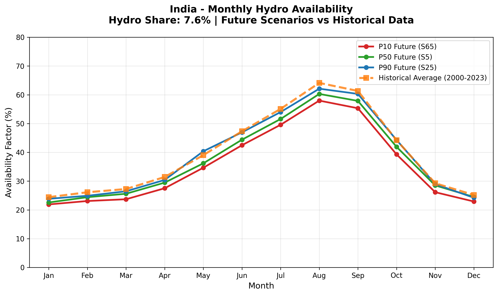
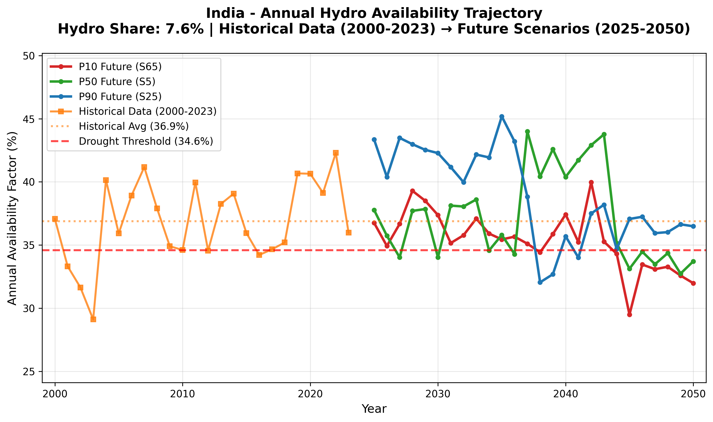

# Hydro Availability — IND

---

Hydroelectric generation is inherently variable due to seasonal patterns, year-to-year climate
variations, and long-term climate change. Traditional energy models often assume constant hydro
availability based on historical averages, which can lead to significant underestimation of backup
capacity needs and inadequate drought preparedness.

**VerveStacks addresses this** by generating probabilistic hydro availability scenarios that capture:

- **Natural variability** — Seasonal wet/dry cycles and multi-year persistence
- **Climate change impacts** — Declining mean availability and increasing extremes
- **Extreme events** — Drought sequences that stress energy systems
- **Country-specific patterns** — Drought thresholds based on historical operational experience

24 years of historical EMBER data (2000–2023) are used to extract seasonal patterns, classify drought
regimes, and apply climate trend adjustments — generating 100+ probabilistic future pathways. Drought
thresholds are anchored to each country's bottom 20% of historical capacity factors, ensuring they
reflect actual operational stress rather than arbitrary percentages.

*→ [Hydro availability scenario methodology](https://vervestacks.readthedocs.io/en/latest/methods/hydro-availability-scenarios.html#hydro-availability-scenarios)*

---

## India Hydro Profile

| Planning Parameter | Value | Application |
|--------------------|-------|-------------|
| **Hydro Dependency** | 7.6% of generation | System vulnerability assessment |
| **P10 (Dry Scenario)** | 35.4% annual average | Security planning, reserve sizing |
| **P50 (Base Scenario)** | 37.3% annual average | Expected case, financial planning |
| **P90 (Wet Scenario)** | 38.9% annual average | Export opportunities, minimum backup |
| **Historical Average** | 36.9% (2000-2023) | Validation benchmark |
| **Drought Threshold** | 34.6% (P20 of historical) | Operational stress indicator |

---

## Monthly Availability Patterns

  
  
<em>Monthly hydro availability — P10/P50/P90 future scenarios vs. historical patterns</em>

## Long-term Trajectory

  
  
<em>Annual hydro trajectories: historical (2000–2023) → future scenarios (2025–2050)</em>

---

## Planning Applications

| Use Case | Recommended Scenario |
|----------|---------------------|
| **Capacity Planning** | P50 for base case sizing; verify adequacy with P10 |
| **Investment Analysis** | P10 for downside risk, P90 for upside potential |
| **System Operations** | P10 for emergency preparedness, P50 for maintenance |
| **Policy Analysis** | Drought impact on energy security and backup requirements |

!!! warning "Key Insight"
    The future will not match historical averages. Planning for hydro variability using
    P10/P50/P90 scenarios is essential for reliable, cost-effective energy systems.