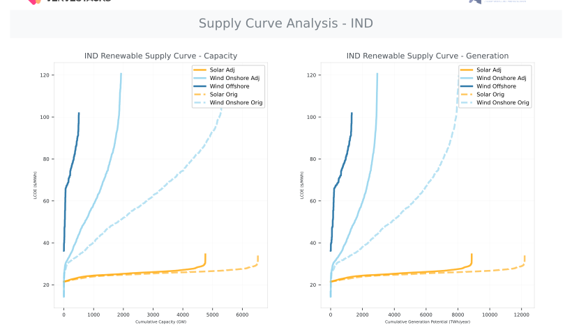
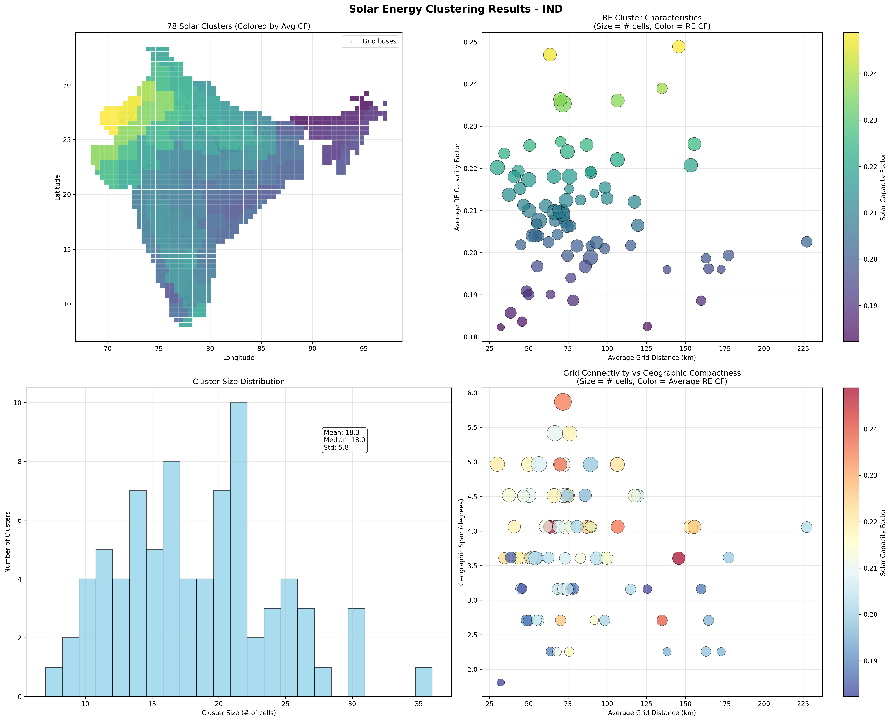
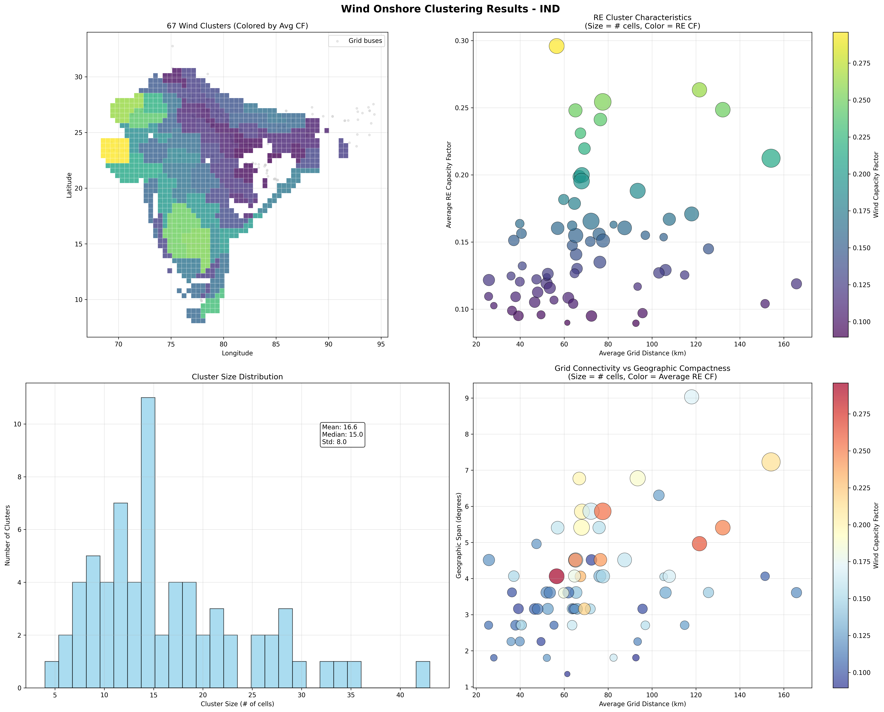
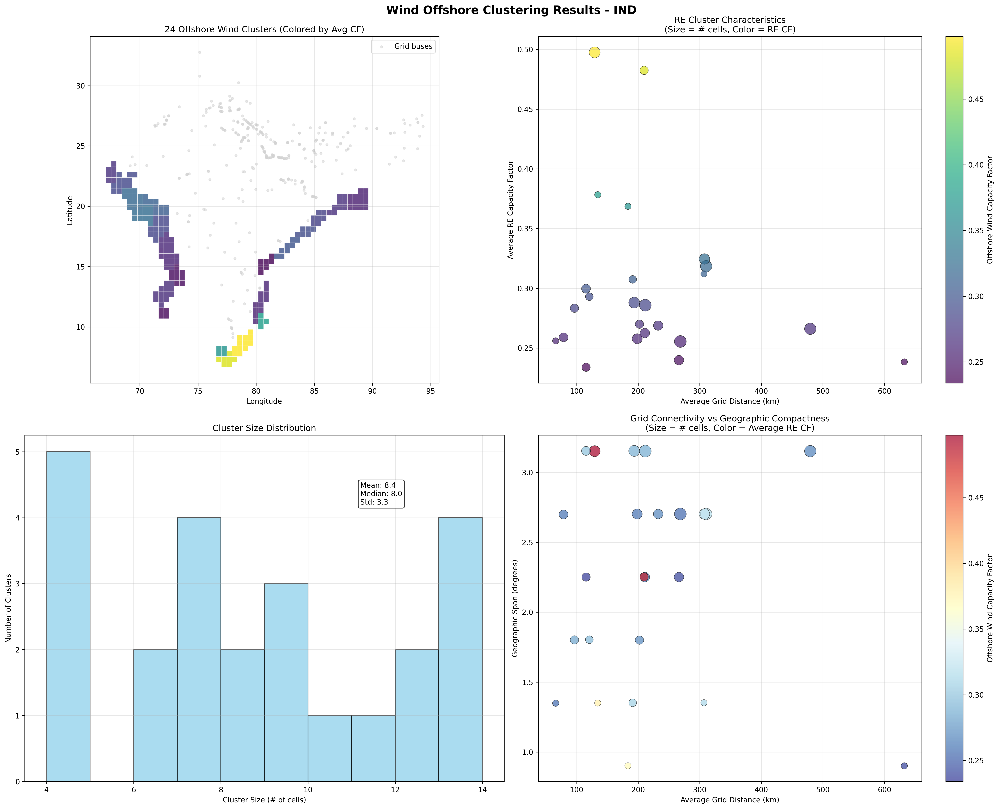

# Renewable Energy Potential — IND

---

## REZoning Data Foundation

VerveStacks builds on the REZoning database, providing detailed potential assessments at 50×50 km
grid resolution across 190+ countries. This high-resolution spatial data captures nuanced variations
in renewable energy resources critical for accurate energy system modelling.

**Data Sources:**

- **Solar Potential** — REZoning solar resource data with capacity factors and LCOE estimates
- **Wind Onshore** — REZoning onshore wind potential with economic viability assessments
- **Wind Offshore** — REZoning offshore wind resources with marine-specific constraints
- **Hourly Profiles** — Atlite-derived capacity factor time series for each grid cell

---

## Land Use Conflict Resolution

Where solar and wind potential overlaps, VerveStacks applies a conservative LCOE-based allocation:
the less competitive technology receives a reduced share of the overlapping area. This ensures supply
curves represent **deployable potential** rather than theoretical maximums, with no double-counting
across technologies.

*→ [Land-use conflict resolution methodology](https://vervestacks.readthedocs.io/en/latest/methods/renewable-characterization.html#stage-1-land-use-conflict-resolution)*

---

## Supply Curves

The supply curves reveal the economic characteristics of renewable energy deployment as capacity scales:

- **LCOE vs Cumulative Capacity** — Economic viability as deployment grows
- **LCOE vs Cumulative Generation** — Resource potential in energy terms
- **Technology Comparison** — Solar, Wind Onshore, and Wind Offshore side-by-side
- **Original vs Land-use Adjusted** — Impact of conservative overlap management

  

---

## Renewable Energy Clustering

| Technology | Grid Cells | Clusters | Avg Cluster Size | Size Range |
|------------|-----------|---------|-----------------|------------|
| ☀️ **Solar PV** | 1431 | 78 | 18.3 cells | 7 to 36 cells |
| 💨 **Wind Onshore** | 1114 | 67 | 16.6 cells | 4 to 43 cells |
| 🌊 **Wind Offshore** | 202 | 24 | 8.4 cells | 4 to 14 cells |

**Grid Definition:** Infrastructure-based transmission buses

Clustering preserves critical **geographic hedging** effects: spatial variations in wind patterns,
east-west and north-south solar resource differences, and distance-based grid connection costs all
survive the aggregation. Each cluster carries a capacity-weighted hourly profile so higher-potential
cells drive the representative generation shape. Only economically viable grid cells enter the process
(Solar PV > 5% CF, Onshore Wind > 8% CF).

*→ [Clustering algorithm details](https://vervestacks.readthedocs.io/en/latest/methods/renewable-characterization.html#stage-2-renewable-resource-clustering)*

---

### Solar PV Clustering

  
  
<em>Solar PV: 78 clusters from 1431 grid cells</em>

### Wind Onshore Clustering

  
  
<em>Wind Onshore: 67 clusters from 1114 grid cells</em>

### Wind Offshore Clustering

  
  
<em>Wind Offshore: 24 clusters from 202 grid cells</em>

