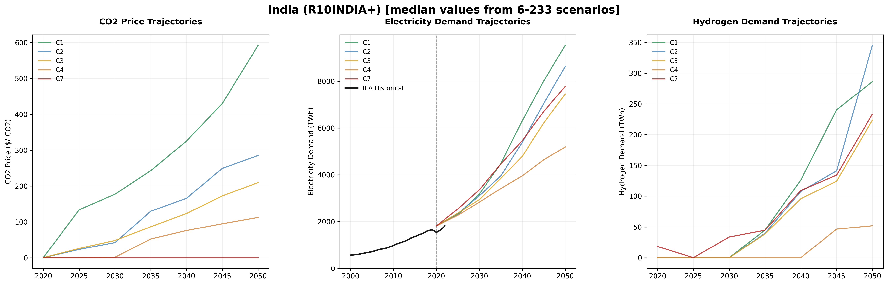

# Climate Scenarios — IND

---

## AR6 Scenario Coverage — R10INDIA+

This model incorporates climate scenario drivers from the IPCC AR6 database for the **R10INDIA+**
region, derived from 350 vetted scenario-model combinations spanning 5
climate categories from ambitious 1.5°C pathways (C1) to limited mitigation trajectories (C7).
The scenarios cover 7 years from 2020 to 2050, providing
comprehensive pathways for energy system transformation under different climate policy futures.

| Metric | Value | Description |
|--------|-------|-------------|
| **Total Scenarios** | 350 | Vetted scenario-model combinations from AR6 database |
| **Climate Categories** | 5 | From C1 (1.5°C) to C7 (limited action) |
| **Temporal Coverage** | 2020–2050 | Multi-decade transformation pathways |
| **Regional Scope** | R10INDIA+ | IPCC R10 regional classification |
| **IEA Baseline Records** | 32 | Historical electricity balance data |

---

## Scenario Trajectories

  
  
<em>CO₂ prices, electricity growth, and hydrogen deployment across climate ambitions</em>

---

## Key Transformation Pathways

**Carbon Pricing Evolution:** CO₂ prices show dramatic divergence across climate ambitions, ranging
from $177 to $0/tCO₂ by 2030 under ambitious vs. limited
action scenarios. By 2050, this gap widens to $592–$0/tCO₂.

**Electrification Acceleration:** Total electricity demand grows by 5.3× under
ambitious climate scenarios (C1) compared to 4.3× under limited action (C7)
by 2050, reflecting massive sectoral electrification across transport, heating, and industry.

**Hydrogen Integration:** Hydrogen deployment reaches 0.0% of electricity
demand by 2050 under ambitious scenarios, compared to 0.0% under limited
action.

**Mobility Transformation:** Transport electricity consumption grows from 2.0%
to 15.0% of total electricity demand under ambitious scenarios — a
7.5× increase.

---

## Model Agreement

Analysis across 350 scenario-model combinations reveals:

- **High Convergence** — CO₂ pricing (CV: inf%) and electricity growth (CV: 32.0%)
- **Moderate Uncertainty** — Transport electrification rates (CV: 63.7%)
- **High Divergence** — Hydrogen deployment pathways (CV: 161.7%)

The **R10INDIA+** region shows moderate convergence compared to global averages,
with region-specific climate policy patterns reflecting economic and policy context.
