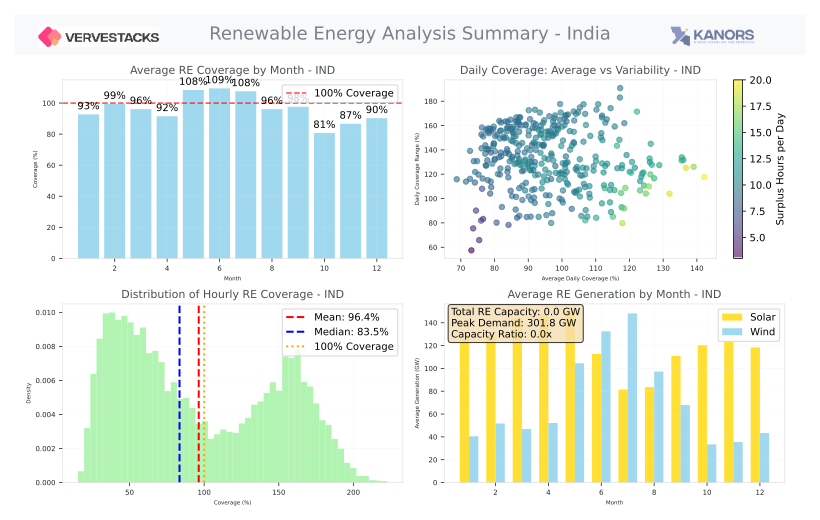

# Temporal Modelling — IND

---

This model employs sophisticated **statistical scenario generation** to identify critical periods
in high-renewable energy systems: **scarcity** (renewable shortfall days), **surplus** (generation
excess days), and **volatile** (high-variability days) — each captured as representative days to
size backup capacity, storage, and flexible resources.

*→ [Stress-based timeslice design](https://vervestacks.readthedocs.io/en/methods/stress-timeslices.html)*

---

## Renewable Energy Analysis Overview

  

---

## Aggregated Days and Hours

Up to 6 seasons × 8 day-night periods = 48 base timeslices:

  

